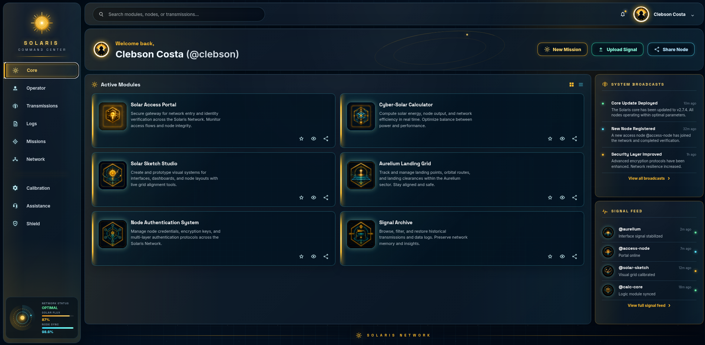

# Admin Dashboard - Solaris Command Center

A responsive, cyber-solar admin dashboard built with semantic HTML, modern CSS, and minimal JavaScript.

Solaris Command Center is designed as the central interface of the Solaris Network, a connected portfolio universe where individual applications are presented as operational modules. The project focuses on dashboard architecture, responsive CSS Grid composition, reusable UI patterns, custom visual assets, and a cohesive design system.

[Live Demo](https://progritit.github.io/Admin-Dashboard/)  
[Repository](https://github.com/progritit/Admin-Dashboard)

```md

```

---

## Table of Contents

- [Overview](#overview)
- [Key Features](#key-features)
- [Technical Objectives](#technical-objectives)
- [Tech Stack](#tech-stack)
- [Architecture and Implementation Notes](#architecture-and-implementation-notes)
- [Project Structure](#project-structure)
- [Responsive Design Strategy](#responsive-design-strategy)
- [Accessibility and Semantics](#accessibility-and-semantics)
- [Getting Started](#getting-started)
- [Deployment](#deployment)
- [Future Improvements](#future-improvements)
- [Acknowledgements](#acknowledgements)
- [License](#license)

---

## Overview

Solaris Command Center reimagines a standard admin dashboard as a futuristic command interface for monitoring a network of applications, signals, and system events.

The dashboard includes:

- a persistent navigation sidebar,
- a top command bar with search and operator controls,
- a welcome/action panel,
- an active modules grid,
- system broadcast cards,
- a signal feed,
- network status indicators,
- a dynamic footer with social links.

The project was built to demonstrate how a static frontend can still communicate product thinking, interface hierarchy, and scalable layout architecture without relying on a JavaScript framework or component library.

---

## Key Features

### Multi-region dashboard layout

The page is structured as a real dashboard interface rather than a single-column landing page.

Core layout regions include:

- sidebar navigation,
- topbar,
- welcome panel,
- active modules grid,
- right rail,
- system broadcasts,
- signal feed,
- internal dashboard footer,
- external site footer.

CSS Grid is used for the major two-dimensional layout areas, while Flexbox is used for smaller one-dimensional alignment patterns.

### Custom Solaris design system

The interface uses a dedicated cyber-solar visual language built around:

- dark cosmic backgrounds,
- solar gold accents,
- cyan and teal highlights,
- glass-style panels,
- glowing borders,
- radial and conic gradients,
- subtle grid textures,
- orbital visual motifs.

The design system is centralized through CSS custom properties, making colors, fonts, radii, shadows, and glow effects easier to maintain.

### Reusable visual asset hierarchy

The project separates visual assets by purpose:

- interface icons are handled through an inline SVG sprite,
- major application cards use custom module emblems,
- the signal feed uses smaller node avatars,
- the operator profile uses a dedicated avatar image,
- the Solaris brand uses a custom logo mark.

This separation keeps the interface visually rich without mixing decorative images and functional icons.

### Responsive dashboard behavior

The layout adapts across multiple viewport sizes:

- desktop: full sidebar with two-column dashboard layout,
- medium screens: compact sidebar and stacked right rail,
- tablet: sidebar becomes a top navigation block,
- mobile: cards and panels stack into a single-column layout.

---

## Technical Objectives

This project prioritizes the following frontend engineering goals:

- build a complex static dashboard using nested CSS Grid,
- organize a large interface into maintainable HTML sections,
- create reusable CSS components without a framework,
- centralize visual decisions through design tokens,
- use pseudo-elements and gradients for visual effects instead of extra markup,
- keep JavaScript minimal and purposeful,
- deliver a deployable static site through GitHub Pages.

---

## Tech Stack

### Core

- **HTML5**
  - Provides semantic structure for the dashboard regions, navigation, panels, cards, and footer.

- **CSS3**
  - Handles layout, responsive behavior, visual identity, component styling, and decorative effects.

- **Vanilla JavaScript**
  - Used only for the dynamic footer year.
  - The project remains static-first and dependency-free.

### Styling and layout

- **CSS Grid**
  - Used for the main app shell, dashboard layout, module grid, right rail, and responsive layout changes.

- **Flexbox**
  - Used for local alignment patterns such as action buttons, section controls, footer links, and compact UI rows.

- **CSS Custom Properties**
  - Used as design tokens for colors, typography, spacing-related values, radii, shadows, and glow effects.

- **Pseudo-elements**
  - Used for decorative overlays, grid textures, glow strips, orbital lines, and panel highlights.

### Assets

- **Inline SVG sprite**
  - Used for reusable UI icons without external icon requests.

- **Custom image assets**
  - Used for the Solaris logo, operator avatar, module emblems, and signal feed avatars.

### Fonts

- **Inter**
  - Used for readable body and interface text.

- **Space Grotesk**
  - Used for headings, labels, and the technical dashboard tone.

---

## Architecture and Implementation Notes

### Static-first structure

The dashboard is intentionally built without a frontend framework. The current scope is presentation-focused, so HTML and CSS are sufficient for the core experience.

This keeps the project:

- lightweight,
- fast to load,
- easy to inspect,
- easy to deploy,
- easy to extend later.

### SVG sprite system

The UI icons are defined once in the HTML as SVG symbols and reused with `<use>` references throughout the interface.

Benefits:

- no external icon package required,
- icons inherit CSS color through `currentColor`,
- fewer file requests,
- consistent sizing and styling.

### Layout composition

The project uses layered grid containers:

```txt
app-shell
├── sidebar
└── page-shell
    ├── topbar
    └── dashboard-grid
        ├── welcome-panel
        ├── modules-section
        ├── right-rail
        └── solar-footer
```

This structure separates page-level layout from component-level layout, making the interface easier to reason about and modify.

### Design token system

Most repeated visual values are stored in `:root`:

```css
:root {
  --panel: rgba(6, 21, 36, 0.78);
  --text: #eef7ff;
  --gold: #ffbd2e;
  --cyan: #58e6ff;
  --radius-lg: 22px;
  --shadow-panel: 0 24px 70px rgba(0, 0, 0, 0.42);
}
```

This allows broad visual changes to be made from one place instead of editing each component individually.

### Reusable panel pattern

The `.glass-panel` class provides a consistent surface style for major UI blocks.

It is reused across:

- sidebar,
- topbar,
- welcome panel,
- modules section,
- rail panels,
- footer.

This reduces duplication and keeps the interface visually consistent.

### Asset components

Generated image assets use shared classes:

- `.module-emblem` for the large module icons,
- `.signal-avatar` for compact signal feed icons,
- `.small-avatar` and `.hero-avatar` for operator identity.

This makes future asset replacement predictable and keeps sizing consistent.

---

## Project Structure

```txt
Admin-Dashboard/
├── index.html
├── style.css
├── script.js
├── README.md
└── assets/
    └── images/
        ├── solarislogo.svg
        ├── operator-avatar-emblem.png
        ├── solar-access-portal-emblem.png
        ├── cyber-solar-calculator-emblem.png
        ├── solar-sketch-studio-emblem.png
        ├── aurelium-landing-grid-emblem.png
        ├── node-authentication-system-emblem.png
        ├── signal-archive-emblem.png
        ├── signal-feed-access-node-avatar.png
        ├── signal-feed-aurelium-avatar.png
        ├── signal-feed-solar-sketch-avatar.png
        └── signal-feed-calc-core-avatar.png
```

### File responsibilities

| File | Purpose |
| --- | --- |
| `index.html` | Defines the page structure, dashboard sections, inline SVG icons, module cards, signal feed, and footer. |
| `style.css` | Contains the design system, layout rules, reusable components, visual effects, and responsive breakpoints. |
| `script.js` | Updates the footer year dynamically. |
| `assets/images/` | Stores the Solaris logo, module emblems, operator avatar, and signal feed avatars. |

---

## Responsive Design Strategy

The dashboard uses targeted breakpoints rather than a one-size-fits-all layout.

### Desktop

- Sidebar and main dashboard sit side by side.
- Active modules use a two-column card grid.
- System Broadcasts and Signal Feed sit in a right rail.

### Medium screens

- Sidebar compresses into an icon-oriented layout.
- The right rail moves below the main module grid.

### Tablet

- Sidebar becomes a top navigation section.
- Main content stacks vertically.
- Module cards and rail panels move into one-column or simplified grid layouts.

### Mobile

- Navigation compresses further.
- Operator text is hidden where necessary.
- Panels and cards use a single-column flow.
- Footer content centers and wraps cleanly.

---

## Accessibility and Semantics

The project includes several accessibility-conscious choices:

- semantic layout elements such as `header`, `main`, `aside`, `section`, `article`, `nav`, and `footer`,
- descriptive `aria-label` attributes for navigation and icon-only controls,
- empty `alt=""` on decorative signal avatars to avoid redundant screen-reader output,
- meaningful `alt` text for important visual identity images,
- visible interactive states for hover and focus where applicable,
- external links using `target="_blank"` with `rel="noopener noreferrer"`.

---

## Getting Started

### Prerequisites

No build tools are required.

You only need:

- a modern web browser,
- Git,
- optionally VS Code with the Live Server extension.

### Clone the repository

```bash
git clone https://github.com/progritit/Admin-Dashboard.git
cd Admin-Dashboard
```

### Run locally with Python

```bash
python3 -m http.server 5500
```

Open:

```txt
http://localhost:5500
```

### Windows alternative

```bash
py -m http.server 5500
```

Open:

```txt
http://localhost:5500
```

### VS Code alternative

```bash
code .
```

Then start the project with the Live Server extension.

---

## Deployment

The project is deployed as a static site using GitHub Pages.

Live site:

```txt
https://progritit.github.io/Admin-Dashboard/

---

## Future Improvements

Potential next iterations:

- link module card actions to live demos and source repositories,
- add a collapsible mobile sidebar,
- implement functional search or filtering,
- add keyboard-focused interaction states to all icon buttons,
- introduce reduced-motion support for future animations,
- convert repeated card data into JavaScript-rendered objects,
- optimize generated PNG assets for smaller file size,
- add a screenshot or short demo GIF to the README,
- add Lighthouse performance and accessibility audit notes.

---

## Acknowledgements

This project was built as part of the Admin Dashboard assignment from The Odin Project's Intermediate HTML and CSS curriculum.

Solaris Command Center is part of the Solaris Network, a personal portfolio concept developed to connect individual frontend projects through a shared visual and narrative system.

AI-assisted tools were used during visual ideation, asset generation, implementation planning, and documentation refinement.

Typography uses Inter and Space Grotesk through Google Fonts. Interface icons are implemented as an inline SVG sprite customized for this project.

---

## License

This project is available for educational and portfolio purposes.

Add a license file if you plan to reuse, distribute, or adapt the project publicly.
